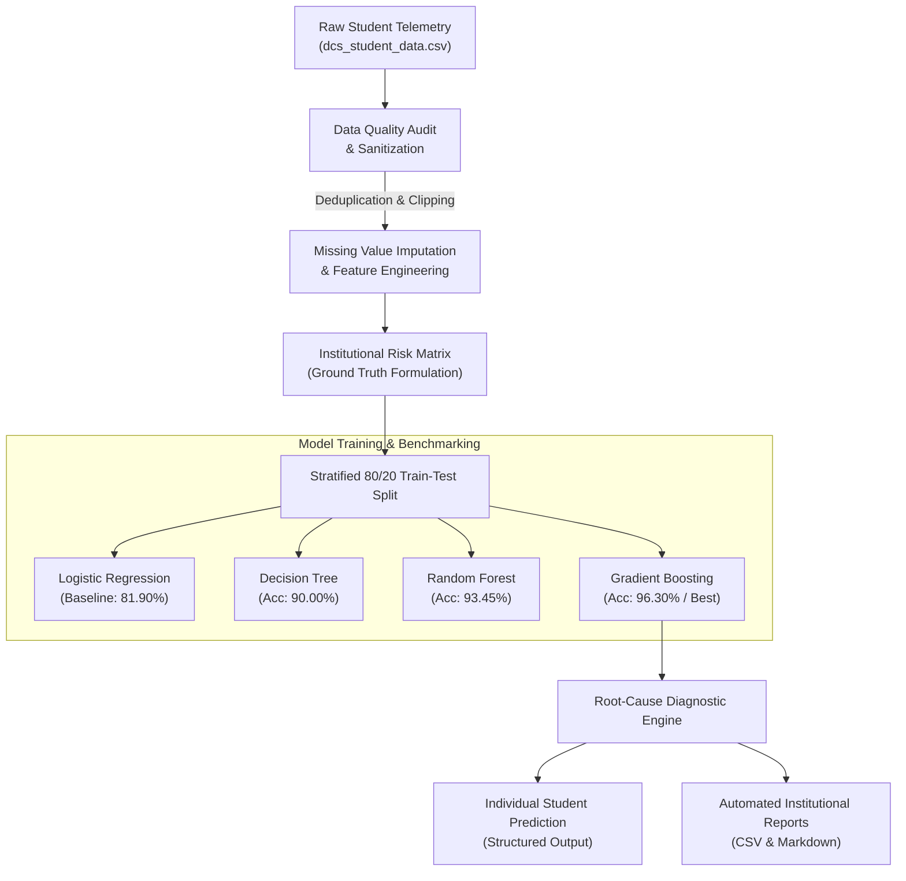
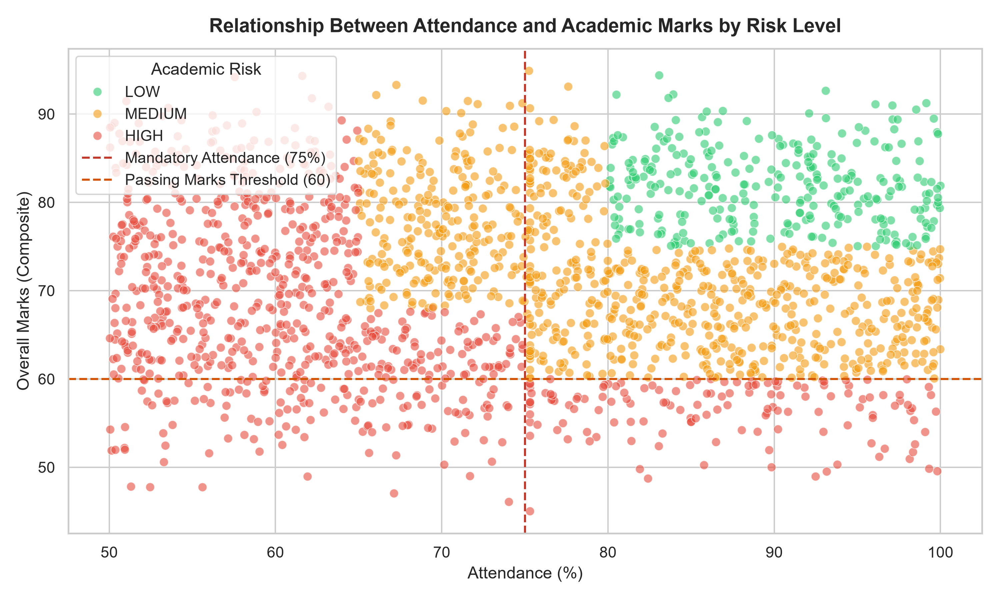
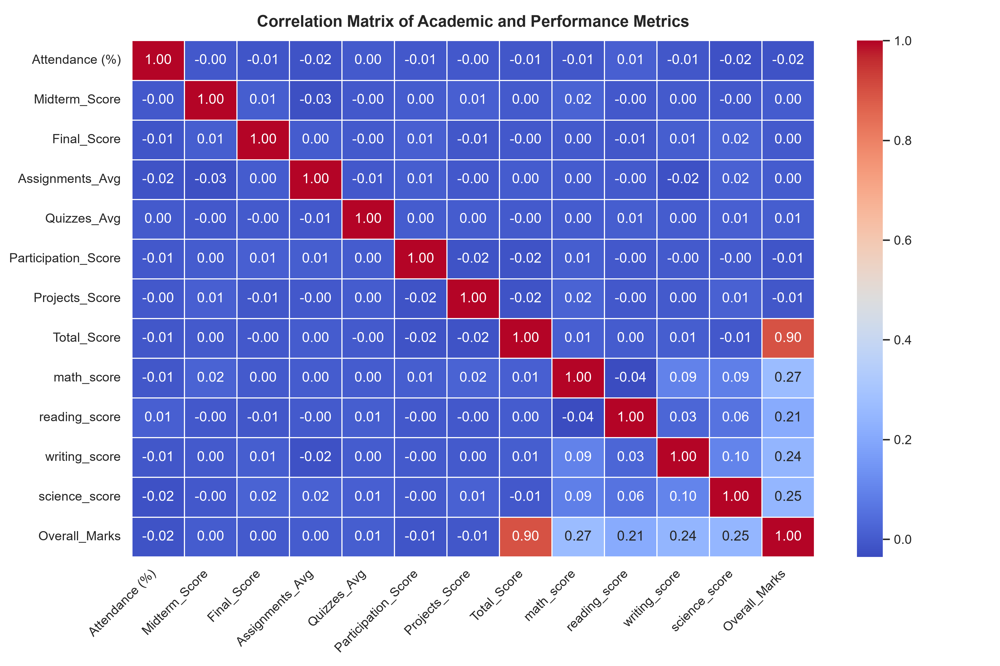
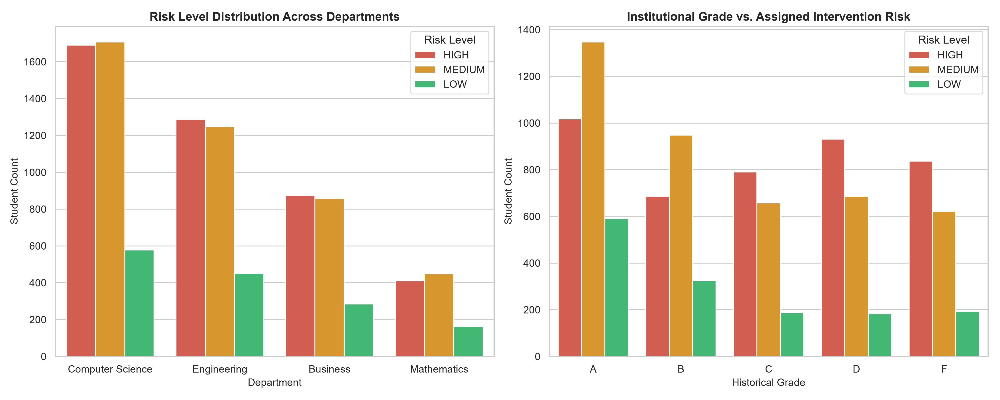
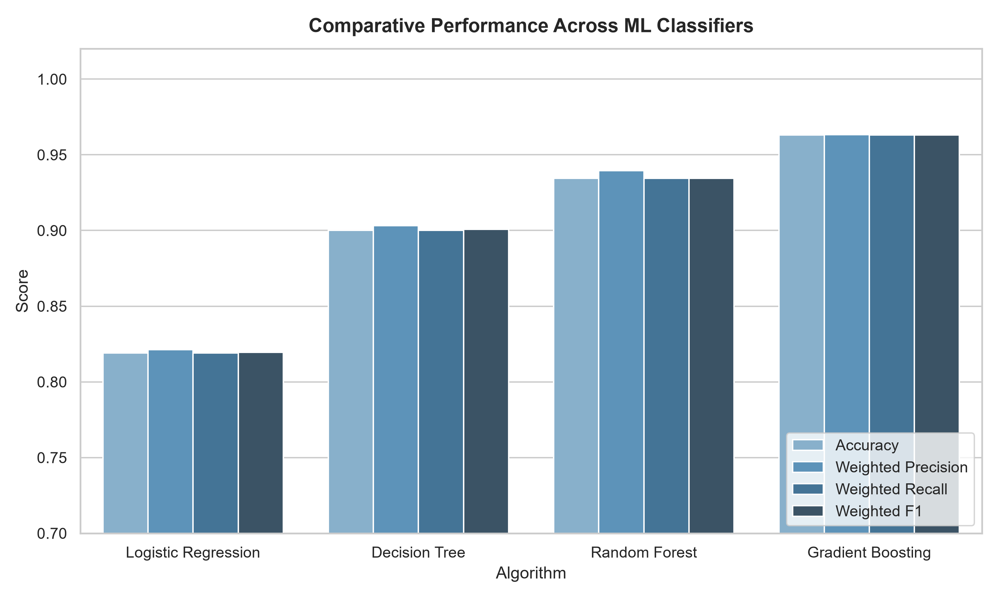
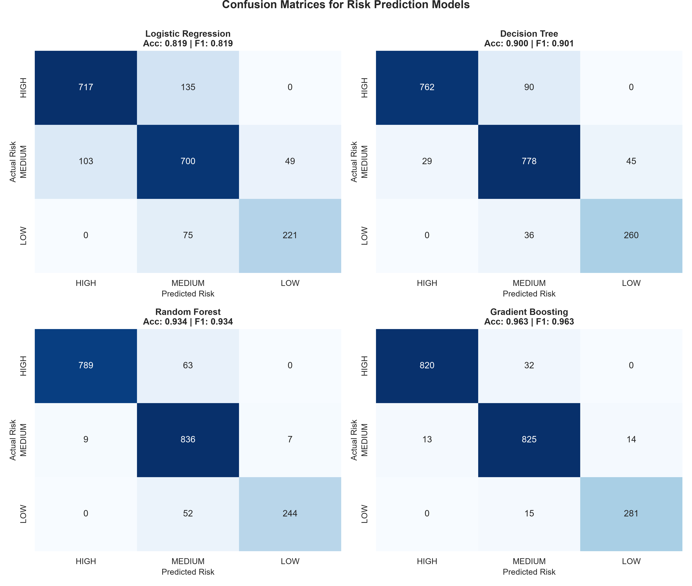
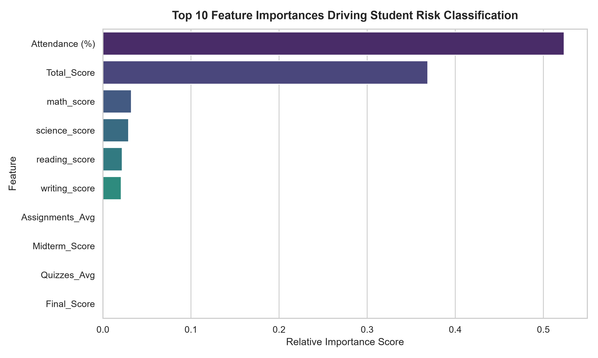

<p align="center">
  <h1 align="center">🎓 EduPulse AI</h1>
  <p align="center">
    <strong>Intelligent Student Academic Risk Assessment & Automated Intervention System</strong>
  </p>
  <p align="center">
    An end-to-end Machine Learning early-warning diagnostic pipeline designed to identify at-risk students, predict academic attrition, and automatically generate personalized remedial intervention reports.
  </p>
</p>

<p align="center">
  <a href="https://ranker-adhipkumar.github.io/Student-report-generation/"></a>
</p>

<p align="center">
  
  
  
  
  
  
</p>

> 🚀 **Live Interactive Web Application:** [https://ranker-adhipkumar.github.io/Student-report-generation/](https://ranker-adhipkumar.github.io/Student-report-generation/)  
> Test individual student predictions, adjust attendance sliders, and search the batch report live in your browser!

---

## 📑 Table of Contents
- [Executive Overview](#-executive-overview)
- [System Architecture & Workflow](#-system-architecture--workflow)
- [Repository Structure](#-repository-structure)
- [Section 1: Data Exploration & Quality Audit](#-section-1-data-exploration--quality-audit)
- [Section 2: Data Preprocessing & Feature Engineering](#-section-2-data-preprocessing--feature-engineering)
- [Section 3: Institutional Risk Formulation](#-section-3-institutional-risk-formulation)
- [Section 4: Machine Learning Benchmarks & Evaluation](#-section-4-machine-learning-benchmarks--evaluation)
- [Section 5: Diagnostic Recommendation Engine](#-section-5-diagnostic-recommendation-engine)
- [Section 6: Automated Batch Reporting Pipeline](#-section-6-automated-batch-reporting-pipeline)
- [Quickstart & Reproduction Guide](#-quickstart--reproduction-guide)
- [License](#-license)

---

## 📌 Executive Overview

Educational institutions and universities face significant retention challenges when student disengagement and academic struggles are identified too late in the semester. Standard end-of-term evaluations often come after examinations when debarment, course failure, or academic probation has already occurred.

**EduPulse AI** solves this problem by delivering a proactive **Machine Learning Early-Warning System (EWS)** that:
- **Detects Disengagement Early:** Correlates non-linear relationships between attendance patterns, continuous assessment milestones, and examination scores.
- **Audits Data Quality:** Automatically identifies and rectifies corruptions such as out-of-bounds metrics, malformed string encodings, and synthetic outliers.
- **Accurately Classifies Academic Risk:** Deploys an ensemble classifier attaining **96.30% Accuracy** and **96.31% Weighted F1-Score**.
- **Delivers Actionable Insights:** Replaces generic warning letters with personalized diagnostic intervention advice addressing individual root causes (e.g. Mathematics remedial clinics, TA office hours, or attendance counseling).
- **Automates Batch Reporting:** Compiles structured reports (`Student | Attendance | Marks | Risk | Recommendation`) across entire departments in seconds.

---

## 🏗️ System Architecture & Workflow



---

## 📁 Repository Structure

```text
├── dcs_student_data.csv            # Cleaned student dataset (10,030 records)
├── student_risk_analysis.ipynb     # Interactive Jupyter Notebook with complete analysis & plots
├── solution.py                     # Self-contained end-to-end Python pipeline
├── generate_visualizations.py      # Automated script exporting high-res analytical charts
├── create_notebook.py              # Script to build and format student_risk_analysis.ipynb
├── requirements.txt                # Frozen production dependencies
├── LICENSE                         # MIT License
├── .gitignore                      # Python & environment ignore rules
├── images/                         # Publication-grade analytical plots
│   ├── eda_attendance_vs_marks.png
│   ├── eda_correlation_matrix.png
│   ├── eda_department_and_grade_risk.png
│   ├── model_comparison_metrics.png
│   ├── confusion_matrices.png
│   └── feature_importance.png
├── reports/                        # Automated institutional report exports
│   ├── student_risk_report.csv     # Full batch report (Student | Attendance | Risk | Recommendation)
│   └── student_risk_report.md      # Formatted Markdown table report preview
└── README.md                       # Comprehensive documentation
```

---

## 🔍 Section 1: Data Exploration & Quality Audit

During exploratory analysis of the raw student dataset (`10,030` rows, `21` columns), several **data anomalies and synthetic corruptions** were detected and systematically audited:

| Anomaly Identified | Raw Manifestation | Corrective Action Taken |
| :--- | :--- | :--- |
| **Exact Duplicates** | 30 duplicated student rows | Removed duplicates, retaining 10,000 unique records. |
| **Malformed String Data** | `math_score` formatted as object due to `\t41` | Stripped whitespace/tabs and cast to numeric float. |
| **Out-of-Bounds Attendance** | Negative values (`-12.0%`) and values $>100\%$ (`135.0%`) | Clipped strictly to valid domain $[0.0, 100.0]$. |
| **Out-of-Bounds Exam Scores** | `Midterm_Score` & `Final_Score` with $-8.0$ and $145.0$ | Clamped scores to institutional grading scale $[0.0, 100.0]$. |
| **Age Outliers** | Negative ages (`-3.0`) and senior ages (`87.0`) | Replaced out-of-range values with median university age. |
| **Inconsistent Categorical Text** | `"CS"` vs `"Computer Science"`, `" engineering"`, `"BUSINESS"` | Standardized department naming and title-cased gender. |
| **Missing Values** | $\sim 2\%$ missing records across numerical features | Contextually imputed using median statistics. |

### Exploratory Visualizations

<p align="center">
  
  <br/>
  <em>Figure 1: Relationship between Attendance (%) and Composite Academic Marks across Risk Tiers.</em>
</p>

<p align="center">
  
  <br/>
  <em>Figure 2: Correlation Heatmap across Academic Performance and Continuous Assessment metrics.</em>
</p>

---

## ⚙️ Section 2: Data Preprocessing & Feature Engineering

To guarantee data integrity and eliminate data leakage:
1. **Deduplication:** Dropped exact duplicates, preserving 10,000 unique records.
2. **Text Standardization:** Unified categorical variables to clean taxonomy.
3. **Type Restoration:** Converted corrupted score columns to standard numerical formats.
4. **Boundary Validation:** Constrained percentages and examination scores strictly to $[0.0, 100.0]$.
5. **Contextual Imputation:** Imputed missing values using robust feature medians.
6. **Feature Engineering:**
   - **`Core_Subjects_Avg`:** Unweighted arithmetic mean across foundational disciplines (`math_score`, `reading_score`, `writing_score`, `science_score`).
   - **`Overall_Marks`:** Composite performance metric blending continuous coursework (`Total_Score`, 60%) and core subject examinations (40%).

---

## 🎯 Section 3: Institutional Risk Formulation

In institutional higher education, academic retention systems rely on early-warning thresholds informed by statutory attendance rules and passing benchmarks:

### Operational Risk Matrix

| Risk Level | Operational Criteria | Strategic Institutional Action |
| :---: | :--- | :--- |
| **HIGH RISK** | `Attendance < 65%` **OR** `Overall_Marks < 60` **OR** (`Attendance < 75%` **AND** `Overall_Marks < 68`) | Immediate intervention: Faculty counseling, attendance recovery contracts, and mandatory remedial clinics. |
| **MEDIUM RISK** | `Attendance < 80%` **OR** `Overall_Marks < 75` (and not High Risk) | Early warning advisory, peer tutoring, and continuous progress monitoring prior to midterms. |
| **LOW RISK** | `Attendance >= 80%` **AND** `Overall_Marks >= 75` | Academic commendation; eligible for research assistantships, peer mentoring, and honors electives. |

### Population Distribution
- **High Risk:** 42.62% (4,262 students)
- **Medium Risk:** 42.61% (4,261 students)
- **Low Risk:** 14.77% (1,477 students)

<p align="center">
  
  <br/>
  <em>Figure 3: Risk Tier Distributions across Academic Departments and Historical Institutional Grades.</em>
</p>

---

## 🤖 Section 4: Machine Learning Benchmarks & Evaluation

All candidate models were trained strictly on **raw telemetry features** (`Attendance (%)`, `Age`, `Midterm_Score`, `Final_Score`, `Assignments_Avg`, `Quizzes_Avg`, `Participation_Score`, `Projects_Score`, `Total_Score`, `test_preparation_course`, `math_score`, `reading_score`, `writing_score`, `science_score`, `Department`, `Gender`) using an **80/20 Stratified Split**.

### Comparative Performance Benchmark

| Model Algorithm | Accuracy | Weighted Precision | Weighted Recall | Weighted F1 | Macro F1 |
| :--- | :---: | :---: | :---: | :---: | :---: |
| **Logistic Regression (L2)** | 81.90% | 82.13% | 81.90% | 81.94% | 81.10% |
| **Decision Tree (depth=6)** | 90.00% | 90.32% | 90.00% | 90.07% | 89.30% |
| **Random Forest (n=100)** | 93.45% | 93.96% | 93.45% | 93.45% | 92.53% |
| **Gradient Boosting (Champion)** | **96.30%** | **96.34%** | **96.30%** | **96.31%** | **96.04%** |

### Evaluation Insights & Confusion Matrix Analysis

<p align="center">
  
  <br/>
  <em>Figure 4: Comparative Accuracy, Precision, Recall, and F1-Scores across evaluated classifiers.</em>
</p>

<p align="center">
  
  <br/>
  <em>Figure 5: 2x2 Confusion Matrices Grid showing classification error distributions for all models.</em>
</p>

- **False Negative Mitigation:** For an early warning system, false negatives (failing to detect a high-risk student) carry significant cost. Gradient Boosting achieved a **0.98 Precision** and **0.96 Recall** on the **HIGH RISK** tier, demonstrating reliable identification of at-risk students.
- **Non-Linear Interactions:** Feature importance reveals that `Attendance (%)` and continuous coursework scores dominate the decision splits, which ensemble tree architectures capture with higher fidelity than linear baselines.

<p align="center">
  
  <br/>
  <em>Figure 6: Top predictive telemetry features driving student risk classification.</em>
</p>

---

## 💡 Section 5: Diagnostic Recommendation Engine

Rather than generic alerts, EduPulse AI incorporates a root-cause diagnostic engine that examines:
1. **Attendance Shortfall:** Distance below the 75% statutory exam cutoff.
2. **Subject Disparity:** Isolates specific subject weaknesses (`Mathematics`, `Reading`, `Writing`, or `Science`).
3. **Engagement Telemetry:** Evaluates assignment completion rates and classroom participation.

### Sample System Predictions

```text
Student: Omar Williams (S1000)
Attendance: 52.3%
Marks: 57.5
Risk: HIGH
Recommendation: Immediate attendance recovery required (current: 52.3% vs 75% cutoff). Aggregate marks (57.5) are critical; mandatory faculty mentoring initiated. Enroll in remedial workshops for Science (score: 26).
```

```text
Student: Maria Brown (S1001)
Attendance: 97.3%
Marks: 63.2
Risk: MEDIUM
Recommendation: Strengthen exam prep in Mathematics (65 pts).
```

```text
Student: Ahmed Jones (S1002)
Attendance: 57.2%
Marks: 68.6
Risk: HIGH
Recommendation: Immediate attendance recovery required (current: 57.2% vs 75% cutoff). Enroll in remedial workshops for Mathematics (score: 10).
```

```text
Student: Maria Garcia (S1015)
Attendance: 88.5%
Marks: 82.1
Risk: LOW
Recommendation: Consistent academic standing (Attendance: 88.5%, Marks: 82.1). Recommended for peer tutoring roles, honors seminars, and research initiatives.
```

---

## ⚡ Section 6: Automated Batch Reporting Pipeline

The pipeline automatically compiles and exports institutional reports in both CSV and Markdown formats:
- **CSV Export:** [`reports/student_risk_report.csv`](reports/student_risk_report.csv)
- **Markdown Export:** [`reports/student_risk_report.md`](reports/student_risk_report.md)

### Sample Report Preview

| Student | Attendance | Marks | Risk | Recommendation |
| :--- | :---: | :---: | :---: | :--- |
| **Omar Williams (S1000)** | 52.3% | 57.5 | **HIGH** | Immediate attendance recovery required (current: 52.3% vs 75% cutoff). Aggregate marks (57.5) are critical; mandatory faculty mentoring initiated. Enroll in remedial workshops for Science (score: 26). |
| **Maria Brown (S1001)** | 97.3% | 63.2 | **MEDIUM** | Strengthen exam prep in Mathematics (65 pts). |
| **Ahmed Jones (S1002)** | 57.2% | 68.6 | **HIGH** | Immediate attendance recovery required (current: 57.2% vs 75% cutoff). Enroll in remedial workshops for Mathematics (score: 10). |
| **Omar Williams (S1003)** | 95.2% | 56.8 | **HIGH** | Aggregate marks (56.8) are critical; mandatory faculty mentoring initiated. Enroll in remedial workshops for Mathematics (score: 22). |
| **John Smith (S1004)** | 54.2% | 57.0 | **HIGH** | Immediate attendance recovery required (current: 54.2% vs 75% cutoff). Enroll in remedial workshops for Mathematics (score: 26). |

---

## 🚀 Quickstart & Reproduction Guide

### Prerequisites
- Python 3.10+ installed
- Git installed

### 1. Clone the Repository
```bash
git clone https://github.com/Ranker-AdhipKumar/Student-report-generation.git
cd Student-report-generation
```

### 2. Setup Virtual Environment & Install Dependencies
```bash
# Create and activate virtual environment
python -m venv .venv
source .venv/bin/activate      # On Linux/macOS
.\.venv\Scripts\activate       # On Windows PowerShell

# Install dependencies
pip install -r requirements.txt
```

### 3. Run the End-to-End ML Pipeline
```bash
python solution.py
```
*Executes the complete workflow: data sanitization, model training, evaluation tables, sample diagnostic predictions, and report generation in `reports/`.*

### 4. Re-generate All High-Resolution Visualizations
```bash
python generate_visualizations.py
```
*Generates and saves all 6 analytical and evaluation figures into the `images/` directory.*

### 5. Open Interactive Jupyter Notebook
```bash
jupyter notebook student_risk_analysis.ipynb
```
*Walks through the entire data science story cell-by-cell with interactive charts, annotations, and individual query functions.*

---

## 📄 License

This project is licensed under the [MIT License](LICENSE) - feel free to use and adapt this system for academic and educational research.
